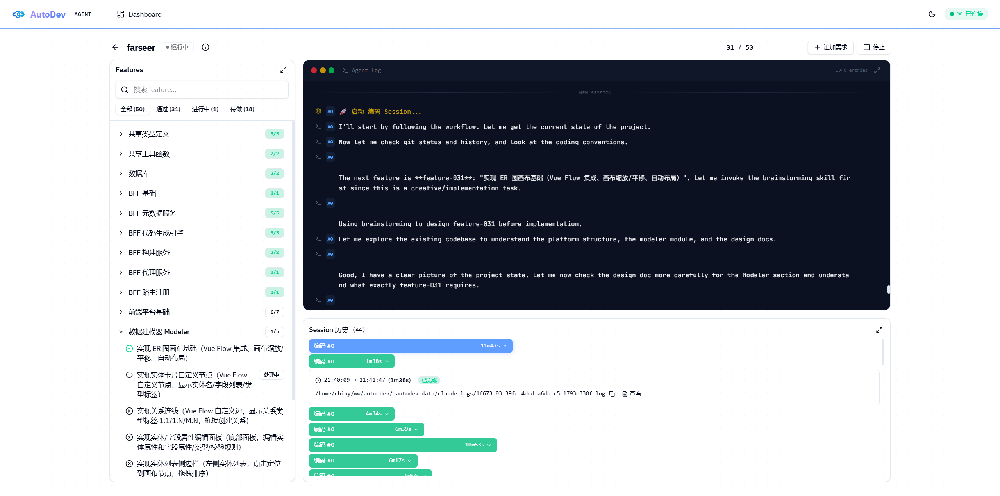

# AutoDev

A fully autonomous AI-powered development platform with multi-provider support. Describe your requirements or import an existing project — AI Agents automatically decompose it into features and implement them one by one, with support for parallel multi-agent development.



## Highlights

### 🔌 Plugin-Based Provider Architecture

The underlying AI tooling is fully decoupled, adapting to different AI coding tools through a unified Provider interface:

- **AgentProvider Interface** — Standardized `buildArgs` / `parseLine` / `isSuccessExit` / `capabilities` declarations
- **AgentEvent Normalization** — All provider outputs are converted into unified `text` / `thinking` / `tool_use` / `system` / `error` events
- **Built-in Claude Code** — Default provider with full `stream-json` streaming output parsing
- **Zero-Code Extension** — Implement the `AgentProvider` interface + call `registerProvider()` to plug in a new tool
- **Capability Declaration** — Each provider declares its supported features (streaming / maxTurns / systemPrompt / agentTeams / modelSelection / dangerousMode); the system adapts automatically
- **`GET /api/providers`** — Frontend dynamically fetches available providers and their capabilities; UI adapts on the fly

### 🧠 Two-Phase Initialization

Inspired by structured planning methodologies, AutoDev splits project initialization into two sequential phases:

- **Phase 1: Architecture Analysis** — A dedicated agent reads the project spec and produces `architecture.md`: tech stack, directory structure, core abstractions, API design, data model, and key architectural decisions
- **Phase 2: Task Decomposition** — The Initializer Agent reads both `app_spec.txt` and `architecture.md` to decompose requirements into features, ensuring every task aligns with the architectural blueprint
- **Feature Context Files** — Each feature gets a `.features/feature-{id}.md` file containing architecture context, related files, dependency graph, and implementation notes — giving coding agents full situational awareness without relying on prompt injection
- **Automatic Chaining** — Phase 1 completes → 3s delay → Phase 2 starts automatically; no manual intervention needed

### 🧠 Based on Anthropic's Long-Running Agent Research

Implements the core patterns from Anthropic's paper [Effective Harnesses for Long-Running Agents](https://www.anthropic.com/engineering/effective-harnesses-for-long-running-agents):

- **Dual-Agent Architecture** — An Architecture + Initializer pipeline decomposes requirements into a Feature List; Coding Agents implement them one by one
- **feature_list.json as Single Source of Truth** — JSON format where only the `passes` field can be modified, preventing agents from tampering with or omitting requirements
- **Incremental Progress** — Each session tackles one feature, commits on completion, ensuring the codebase is always mergeable
- **Context Bridging** — Uses `claude-progress.txt` + `git log` to bring new sessions up to speed on project state, solving the memory fragmentation problem across context windows

### 🔀 Multi-Agent Parallel Development

Goes beyond Anthropic's original single-agent sequential approach with full parallel support:

- Each agent works on an isolated Git branch (`agent-{index}/feature-{featureId}`), with zero interference
- `claimedFeatures` Map atomically assigns features, guaranteeing no two agents claim the same task
- Git operations are serialized through a Promise queue to avoid concurrency conflicts
- Completed features are automatically merged back to main via `git merge --no-ff`; merge conflicts are automatically resolved by a dedicated AI agent
- Setting `concurrency = 1` gracefully degrades to sequential mode, fully backward-compatible

### 🤖 Agent Teams Mode

A third execution mode — the system launches a single AI session, and the AI internally uses Agent Teams to coordinate multiple sub-agents:

- Coordination logic shifts from the system to the AI itself; the AI autonomously decides task allocation and parallelism strategy
- Fully automated end-to-end: understand requirements → plan architecture → generate Feature List → initialize project → parallel development → wrap up
- All agents work on the main branch, avoiding conflicts through frequent commits
- Enable by checking "Agent Teams Mode" when creating a project
- Requires provider support for the `agentTeams` capability (currently Claude Code only)

### 🎯 Project-Level System Prompts

Configure a custom system prompt for each project, applied uniformly across all agents (initializer, coding, parallel-coding, agent-teams, append-initializer):

- Set during project creation/import in advanced options, or modify anytime from the project detail page
- Injected via the Claude CLI `--system-prompt` flag, kept separate from the task prompt
- Changes take effect on the next session without interrupting any currently running session
- Ideal for injecting coding standards, tech stack preferences, language requirements, and other project-level constraints

### 📋 Task List Review Mode

Optionally enable "Review task list after initialization" when creating a project, letting you review and adjust the Feature List before coding begins:

- When enabled, the Initializer Agent generates the Feature List and the project enters a `reviewing` state — coding does not start automatically
- The review UI supports selecting individual or all features; enter modification instructions and click "AI Modify" to have Claude adjust the selected tasks
- Supports editing descriptions, adjusting steps, splitting/merging/deleting features
- Click "Confirm and Start Coding" to officially begin the coding phase

### 📦 One-Click Import of Existing Projects

Not just for greenfield — import existing code repositories too:

- Automatically scans directory structure, README.md, CLAUDE.md, docs/*.md, package.json
- Assembles scanned content into a project spec, pointing directly at the original directory without copying files
- After import, start the agent to begin autonomous development immediately

### 🖥️ Real-Time Web Monitoring Dashboard

Full visibility throughout — no black boxes:

- Dashboard with project cards + progress bars for an at-a-glance view of all project statuses
- Project detail page: Feature List on the left (grouped by category, ✅/❌ status, 🔄 indicating the active agent), real-time terminal-style logs on the right
- In parallel mode, switch logs by Agent tab; the header shows the number of active agents
- **Session Gantt Chart** — Each session is represented as a horizontal bar, scaled by duration, for instant efficiency insights; bars display task descriptions (features auto-inferred from logs)
- **Session Log Viewer** — Click "View" to open a side panel with raw Claude output, parsed from stream-json into color-coded categories (assistant / tool_use / error, etc.), with graceful 404 handling for deleted log files
- **Runtime Requirement Appending** — Append new requirements while the project is running; the system automatically decomposes them into features and adds them to the task queue
- All panels support fullscreen toggle; Feature List, Agent Log, and Session History can each be viewed independently in fullscreen
- WebSocket push updates with zero-latency refresh

### ✅ Quality Gate

Optional per-project verification command that runs before any feature is marked as passed:

- Configure a `verifyCommand` (e.g. `npm test && npm run lint`) when creating or importing a project
- Coding agents (serial and parallel) automatically run the command after implementing each feature
- If verification fails, the agent attempts to fix the issues; after 2 failed attempts, the feature stays `passes: false`
- Ensures code quality without relying on agents to self-assess — the gate is objective and automated

### 🤝 Human-in-the-Loop Collaboration

Agents aren't isolated — they proactively ask for help when stuck:

- When an agent outputs `[HUMAN_HELP] problem description`, the system automatically captures it and pushes a notification to the frontend
- User responses are written to `.human-response.md`; the agent reads it on next startup and continues
- Useful for missing configurations, ambiguous requirements, or decisions that need human judgment

### 🛡️ Production-Grade Robustness

Reliability designed for real-world use:

- **Token Authentication** — `AUTODEV_TOKEN` environment variable controls API and WebSocket access (Bearer header / query param); omit to skip auth
- **Path Sandboxing** — `isPathSafe()` restricts checkDir / importProject / raw-log paths to home / tmp / cwd, preventing path traversal
- **Explicit State Machine** — `state-machine.ts` defines all legal state transitions, replacing scattered if-else logic and eliminating illegal states
- **Wall-Clock Timeout** — 30 minutes with no stdout output triggers automatic SIGTERM + SIGKILL, preventing zombie processes
- **Retry Limits** — Each feature retries up to 3 times; exceeded limits auto-skip and flag the feature, preventing infinite loops
- **Feature Lifecycle** — `failCount` / `lastAttemptAt` track failure history; `inProgress` is managed at the system level (not by agents)
- **claimedFeatures Persistence** — Written to `claimed.json`; claim state is automatically restored on service restart
- **Process Recovery** — On restart, the service detects orphan processes, cleans up via persisted PIDs, and resets state
- **WebSocket Heartbeat** — Server-side 30s ping/pong; zombie connections are automatically terminated
- **Exponential Backoff Reconnection** — Client reconnects at 3s → 6s → 12s → 24s → 30s cap; state is auto-refreshed on reconnect
- **Log Persistence** — JSONL append-only format with auto-truncation at 5,000 entries; legacy `logs.json` files are auto-migrated
- **Smart Log Filtering** — JSON-formatted thinking processes are parsed into readable summaries for real-time display (not persisted), reducing noise
- **Frontend Performance** — `React.memo` + `content-visibility: auto` for browser-native virtualization; log cap at 3,000 entries to prevent memory overflow
- **Startup Heartbeat** — Shows a waiting indicator after 15 seconds of no output, so users don't think it's frozen
- **Graceful Shutdown** — SIGTERM → wait 5s → SIGKILL, ensuring no lingering processes

---

## Tech Stack

| Layer | Technology |
|---|------|
| Frontend | React 19 + TypeScript + Vite + Tailwind CSS v4 + Radix UI |
| State Management | Zustand |
| Backend | Express + WebSocket (ws) |
| AI Engine | Plugin-based providers (built-in Claude Code CLI, extensible to Codex / Gemini / Aider, etc.) |
| State Management (Backend) | Explicit state machine (state-machine.ts) |
| Testing | Vitest (61 tests) |
| Version Control | Git (branch isolation + auto-merge) |

## Quick Start

```bash
# Install dependencies
npm install

# Start frontend and backend simultaneously
npm start
```

- Frontend: `http://localhost:5173`
- Backend API: `http://localhost:3001`
- WebSocket: `ws://localhost:3001/ws`

Prerequisites: At least one AI coding tool installed and configured (default: [Claude Code CLI](https://docs.anthropic.com/en/docs/claude-code)).

### Security Configuration (Optional)

```bash
# Set API token (omit to skip authentication)
export AUTODEV_TOKEN=your-secret-token
```

### Testing

```bash
npm test          # Run 61 unit tests
```

## Extending Providers

Implement the `AgentProvider` interface to plug in a new AI coding tool:

```typescript
// server/providers/codex.ts
import type { AgentProvider } from './types.js'

export const codexProvider: AgentProvider = {
  name: 'codex',
  displayName: 'OpenAI Codex',
  binary: 'codex',
  capabilities: {
    streaming: true,
    maxTurns: false,
    systemPrompt: true,
    agentTeams: false,
    modelSelection: true,
    dangerousMode: false,
  },
  buildArgs(ctx) {
    return ['--json', '-p', ctx.prompt, '--model', ctx.model]
  },
  parseLine(line) {
    // Parse codex output format → normalized AgentEvent
    const event = JSON.parse(line)
    if (event.type === 'message') return { type: 'text', content: event.content }
    return { type: 'ignore' }
  },
  isSuccessExit(code) { return code === 0 },
}
```

Then register it in `registry.ts`:

```typescript
import { codexProvider } from './codex.js'
registerProvider(codexProvider)
```

The frontend provider selector automatically picks up the new option — zero UI changes needed.

## Project Structure

```
├── server/                    # Backend service
│   ├── index.ts               # Express + WebSocket entry (heartbeat + token auth)
│   ├── routes/api.ts          # REST API routes (auth middleware + path sandboxing)
│   ├── providers/             # AI Provider plugin layer
│   │   ├── types.ts           # AgentProvider interface + AgentEvent normalized events
│   │   ├── claude.ts          # Claude Code CLI implementation
│   │   └── registry.ts        # Provider registry + query API
│   ├── services/
│   │   ├── agent.ts           # Agent scheduling engine (core, provider-agnostic)
│   │   ├── project.ts         # Project CRUD + feature sync + path sandboxing
│   │   └── state-machine.ts   # Project state machine (explicit transition table)
│   ├── prompts/
│   │   ├── architecture.md    # Architecture analysis prompt (phase 1)
│   │   ├── initializer.md     # Task decomposition prompt (phase 2, reads architecture.md)
│   │   ├── append-initializer.md # Append requirement decomposition prompt
│   │   ├── coding.md          # Sequential coding Agent prompt
│   │   ├── coding-parallel.md # Parallel coding Agent prompt
│   │   ├── agent-teams.md     # Agent Teams end-to-end prompt
│   │   └── merge-resolve.md   # AI merge conflict resolution prompt
│   └── types.ts
├── src/                       # Frontend
│   ├── pages/
│   │   ├── Dashboard.tsx      # Project list + create/import
│   │   └── ProjectDetail.tsx  # Project detail (features + logs + timeline)
│   ├── components/
│   │   ├── ui/                # Base UI components (Badge, Card, Dialog, Sheet, etc.)
│   │   ├── project/           # CreateProjectDialog, ImportProjectDialog, FeatureList
│   │   └── agent/             # AgentLog, SessionTimeline, HelpDialog
│   ├── store/index.ts         # Zustand global state
│   ├── hooks/useWebSocket.ts  # WebSocket connection management (exponential backoff)
│   └── lib/api.ts             # API client
└── .autodev-data/             # Runtime data (auto-created)
    ├── projects/              # Project metadata + features + sessions + logs (JSONL)
    └── claude-logs/           # Raw agent output logs
```

## API

| Method | Path | Description |
|------|------|------|
| GET | `/api/providers` | List available AI providers and their capabilities |
| GET | `/api/projects` | List projects |
| GET | `/api/projects/:id` | Get project details |
| POST | `/api/projects` | Create a project |
| POST | `/api/projects/import` | Import an existing project |
| DELETE | `/api/projects/:id` | Delete a project |
| POST | `/api/projects/:id/start` | Start the agent |
| POST | `/api/projects/:id/stop` | Stop the agent |
| GET | `/api/projects/:id/features` | List features |
| GET | `/api/projects/:id/sessions` | Get session history |
| GET | `/api/projects/:id/sessions/:sid/raw-log` | Get raw session log (plain text) |
| GET | `/api/projects/:id/logs` | Get real-time log history |
| GET | `/api/projects/:id/help-requests` | Get pending human assistance requests |
| POST | `/api/projects/:id/help-response` | Submit a human assistance response |
| PUT | `/api/projects/:id/system-prompt` | Update the system prompt |
| POST | `/api/projects/:id/review-features` | AI-modify selected features in review mode |
| POST | `/api/projects/:id/confirm-review` | Confirm review and start coding |
| POST | `/api/projects/:id/append-spec` | Append requirements at runtime |

WebSocket `/ws` push message types: `log`, `status`, `progress`, `feature_update`, `features_sync`, `session_update`, `agent_count`, `human_help`

## AI Agent Workflow

### Overall Architecture

```
┌─────────────────────────────────────────────────────┐
│          User Input / Import Existing Project        │
└──────────────────────┬──────────────────────────────┘
                       ▼
            ┌────────────────────┐
            │ Architecture Agent │  Phase 1
            │                    │
            │ • Read app_spec    │
            │ • Produce          │
            │   architecture.md  │
            └────────┬───────────┘
                     ▼
              ┌─────────────────┐
              │ Initializer Agent│  Phase 2
              │                 │
              │ • Read arch doc │
              │ • Generate      │
              │   feature_list  │
              │   .json         │
              │ • Generate      │
              │   .features/    │
              │ • Create init.sh│
              │ • git init      │
              └────────┬────────┘
                       ▼
           ┌───────────────────────┐
           │  concurrency = 1 ?    │
           └───┬───────────────┬───┘
           Yes │               │ No
               ▼               ▼
        ┌────────────┐  ┌──────────────┐  ┌──────────────┐
        │ Single     │  │ Multi-Agent  │  │ Agent Teams  │
        │ Agent      │  │ Parallel     │  │ Self-        │
        │ Sequential │  │ Mode         │  │ Coordinated  │
        └────────────┘  └──────────────┘  └──────────────┘
               │               │                │
               └───────────────┼────────────────┘
                               ▼
                    ┌─────────────────────┐
                    │  Provider Abstraction│
                    │       Layer          │
                    │                     │
                    │  buildArgs()        │
                    │  parseLine()        │
                    │  isSuccessExit()    │
                    └──────────┬──────────┘
                               │
              ┌────────────────┼────────────────┐
              ▼                ▼                ▼
        ┌──────────┐   ┌──────────┐    ┌──────────┐
        │  Claude  │   │  Codex   │    │  Gemini  │
        │  Code    │   │  CLI     │    │  CLI     │
        └──────────┘   └──────────┘    └──────────┘
```

> Agent Teams mode is enabled by checking the option at project creation, bypassing the branching logic above and launching a single end-to-end Claude session.

### Mode 1: Single-Agent Sequential Development (concurrency = 1)

One Coding Agent works on the `main` branch, completing features one by one in priority order.

```
Session 2          Session 3          Session 4
┌──────────┐      ┌──────────┐      ┌──────────┐
│ Coding   │ ───► │ Coding   │ ───► │ Coding   │ ───► ...
│ Agent    │ 3s   │ Agent    │ 3s   │ Agent    │
│          │      │          │      │          │
│ Feature A│      │ Feature B│      │ Feature C│
└──────────┘      └──────────┘      └──────────┘
     │                 │                 │
     ▼                 ▼                 ▼
  git commit        git commit        git commit
  on main           on main           on main
```

Each session follows a 10-step workflow:

1. **Orient** — `pwd` → read `claude-progress.txt` → read `feature_list.json` → `git log`
2. **Start Services** — Run `init.sh` or manually start the dev server
3. **Regression Check** — Spot-check 1–2 previously passing features to confirm no regressions
4. **Select Target** — Pick the highest-priority incomplete feature from feature_list.json
5. **Implement** — Write code (frontend + backend)
6. **End-to-End Test** — Verify functionality via browser automation
7. **Update Status** — `passes: false → true`
8. **Commit** — `git add + commit`
9. **Update Progress** — Write to `claude-progress.txt`
10. **Clean Exit** — Ensure no uncommitted changes remain

### Mode 2: Multi-Agent Parallel Development (concurrency = 2–8)

Multiple Coding Agents work simultaneously, each on an isolated Git branch developing a different feature.

```
                    ┌─────────────┐
                    │    main     │
                    └──────┬──────┘
                           │
              ┌────────────┼────────────┐
              ▼            ▼            ▼
     ┌──────────────┐ ┌──────────────┐ ┌──────────────┐
     │   Agent 0    │ │   Agent 1    │ │   Agent 2    │
     │ branch:      │ │ branch:      │ │ branch:      │
     │ agent-0/     │ │ agent-1/     │ │ agent-2/     │
     │ feature-003  │ │ feature-007  │ │ feature-012  │
     └──────┬───────┘ └──────┬───────┘ └──────┬───────┘
            │                │                │
            ▼                ▼                ▼
     ┌──────────────────────────────────────────────┐
     │          Git Merge Queue (serialized)         │
     │                                              │
     │  → Success: merge to main, claim next feature│
     │  → Conflict: AI agent resolves automatically;│
     │    falls back to manual only if AI fails      │
     └──────────────────────────────────────────────┘
```

Key mechanisms in parallel mode:

| Mechanism | Description |
|------|------|
| Atomic Feature Assignment | `claimedFeatures` Map ensures no two agents claim the same feature |
| Branch Isolation | `agent-{index}/feature-{featureId}`, zero interference |
| Git Lock | Promise queue serializes all git operations |
| Auto-Merge | `git merge --no-ff` back to main, preserving branch history |
| Conflict Handling | AI-powered: on merge failure, a dedicated conflict-resolution agent is spawned to read markers, resolve intelligently, and commit; falls back to manual only if AI fails |
| Error Retry | Agent auto-retries with a new feature after 5 seconds on abnormal exit |

### Lifecycle State Machine

```
                 ┌──────────┐
  Create/Import ─►│   idle   │
                 └────┬─────┘
                      │ Start
                      ▼
              ┌──────────────┐
              │ initializing │  Initializer Agent running
              └──────┬───────┘
                     │ feature_list.json generated
                     ▼
              ┌──────────────┐
              │  reviewing   │  Review mode (optional)
              └──────┬───────┘
                     │ Confirm review
                     ▼
              ┌──────────────┐  ◄── Auto-resume (3s delay)
              │   running    │──────────────┐
              └──┬───────┬───┘              │
       Manual    │       │ All passed       │
       stop      │       │                  │
                 ▼       ▼           Session N ends
          ┌────────┐ ┌───────────┐
          │ paused │ │ completed │
          └────────┘ └───────────┘
```

## References

- [Anthropic: Effective Harnesses for Long-Running Agents](https://www.anthropic.com/engineering/effective-harnesses-for-long-running-agents)
- [Anthropic: Autonomous Coding Quickstart](https://github.com/anthropics/claude-quickstarts/tree/main/autonomous-coding)
- [Claude 4 Prompting Guide: Multi-Context Window Workflows](https://docs.claude.com/en/docs/build-with-claude/prompt-engineering/claude-4-best-practices#multi-context-window-workflows)
